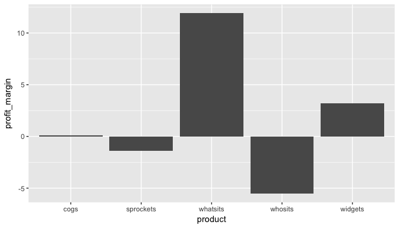
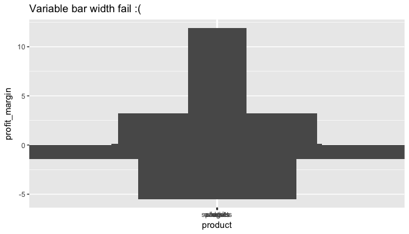
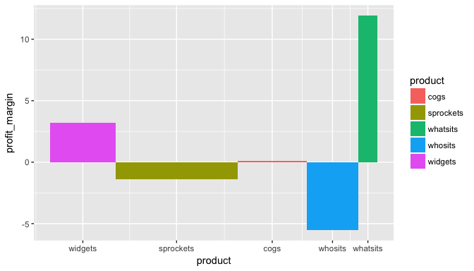
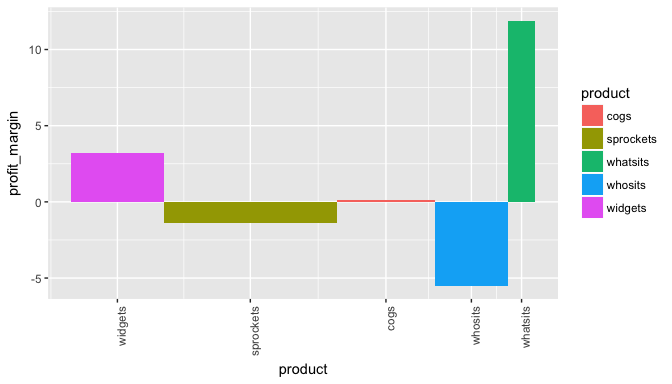

# Introduction to the mekko package

### Marimekko and bar mekko graphics in R

This is a quick introduction to the marimekko and bar mekko functions in 
the mekko package.

Their main value is to add quantitative context to a bar graph, via bar width.


<br>
Install with:

```r
devtools::install_github('ryninho/mekko', build_vignettes = TRUE)
```

View examples with:

```r
vignette("mekko-vignette")
```


### Bar mekko

Let's take a look at profit margin by product using ggplot2.


```r
ggplot(profits, aes(x = product, y = profit_margin)) + 
  geom_bar(stat = "identity")
```

<!-- -->

Well that's insightful, but I don't know how worried I should be about the
margin on whosits or cogs, nor do I know how happy I should be about whatsits
knocking it out of the park. Maybe I can add revenue as the bar width so I know
what's important here?


```r
ggplot(profits, aes(x = product, y = profit_margin, width = revenue)) + 
  geom_bar(stat = "identity") + 
  labs(title = "Variable bar width fail :(")
```

```
## Warning: position_stack requires non-overlapping x intervals

## Warning: position_stack requires non-overlapping x intervals
```

<!-- -->

Well shucks, that looks like some kind of Atari game airplane. Let's use the 
mekko package to put our margins in context.


```r
bmx <- barmekko(profits, product, profit_margin, revenue)
bmx
```

<!-- -->

Alright, so actually the weak margins on sprockets are worth as much focus as
the problem with whosits. Also, no high-fives for margins on the whatsits until
we triple sales of them.

Those labels are a little close together- this is a ggplot object so let's use
the usual method of rotating the axes.


```r
bmx + theme(axis.text.x = element_text(angle = 90, hjust = 1))
```

<!-- -->

### Marimekko

The marimekko similarly provides context via bar width, but this time with a 
100% stacked bar.


```r
ggplot(market, aes(x = company, y = sales, fill = region)) + geom_bar(stat = "identity", position = "fill")
```

<!-- -->

Looks like Acme is heavily concentrated in the domestic market and Cogswell and
Spacely are dabbling in intergalactic commerce. Is the latter a market I should
be thinking about?


```r
marimekko(market, company, region, sales)
```

<!-- -->

Now I can see that the intergalactic market is actually pretty substantial- 
outside of Acme, which I can see by eyeballing the chart above has about half
of the domestic market making it far and away the domestic leader, the 
intergalactic is almost as big as the non-Acme domestic market. If Acme's 
domestic dominance is impenetrable it might make more sense to focus on 
intergalactic expansion as well as of course the largest market which is global.
